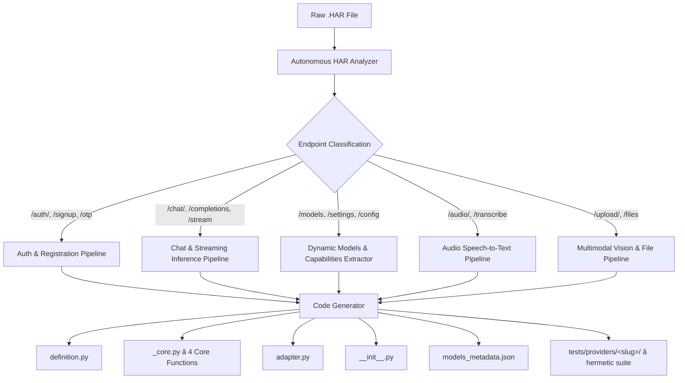

# 🏛️ UNIVERSAL PROVIDER SPECIFICATION & ARCHITECTURAL BLUEPRINT (v3.0)
## Autonomous HAR Scaffolding, Dynamic Capability Ingestion & the 15-Minute SLA Standard

**Authors & Architectural Authority:** Eng. Bolla (Lead Architect) & Eng. Zizo (Product Visionary)
**System:** AI Gateway Service (`__gateway-service/`)
**Target Audience:** Any AI Coding Agent (Flash / Claude Opus / Sonnet / Codex) & Human Engineers
**Compliance Standard:** Bolla Constitution v1.2 & ADR-0008 (Gateway Wire Contract v1)
**Target SLA:** *"Raw HAR In ➡️ Tested Production Provider Out in < 15 Minutes"* ("ربع ساعة! طخ طخ طخ!")
**Status:** Canonical Master Standard — v3.0 (additive over v1.0/v2.0, zero breaking changes)
**Normative Language:** The keywords **MUST / MUST NOT / SHOULD / MAY** are to be interpreted as in RFC 2119.

---

## 📜 0. Versioning, Compatibility & Changelog

This document is additive. Breaking changes require a new major version and a dedicated ADR.

| Version | Change | Compatibility |
|:---|:---|:---|
| **v1.0** | Original Universal Provider Contract: 4-file architecture, 4 core functions, closed capability set. | Baseline |
| **v2.0** | 60-minute onboarding benchmark, Facade adapter layer, 12-error facade envelope, `FileLock` account pools. | Additive |
| **v3.0** | (1) Autonomous HAR scaffolder `tools/har_to_provider.py`; (2) 15-minute SLA; (3) Two-layer capability model (Gateway Capabilities vs Provider Features); (4) Canonical enumeration of the 12 typed errors; (5) `models_metadata.json` schema; (6) Bounded background refill; (7) HAR security & redaction rules; (8) Definition of Done gate. | **Additive — zero breaking changes** |

Any provider compliant with v1.0/v2.0 remains compliant with v3.0 unless it violates the security or Definition-of-Done gates, which apply retroactively as **hard gates**.

---

## ⚡ 1. The Paradigm Shift: From 60 Minutes to the 15-Minute SLA

Blueprint v2.0 established the 60-minute onboarding benchmark. As articulated by **Eng. Zizo in Voices 97 & 98**, manual inspection of massive `.har` archives, hand-coding repetitive HTTP dictionaries, and deciphering JSON response envelopes introduce human friction, fatigue, and avoidable delay.

> ### 🚀 The Zizo 15-Minute Operational Mandate ("ربع ساعة طخ طخ طخ"):
> *"أنا عاوز أزود ده يخلص في ربع ساعة! تقول لي إزاي؟ في حاجة كدا زي سكريبت كدا، يفلتر الـ HAR: بتاع الشات، بتاع الإنشاء، بتاع الـ Refresh، بتاعوديلات، والكابابيليز... يتع كله أوتيك كدا في السريع!"*
> — **هندس زيزو (فويس 98)**

### ⏱️ The 15-Minute Stopwatch Breakdown

| Time Window | Phase | Mechanism | Deliverable |
|:---|:---|:---|:---|
| **00:00–02:00** | HAR Capture | Browser DevTools (signup, chat, vision, audio, models) | Raw `.har` in workspace |
| **02:00–04:00** | Autonomous Scaffolding | `py tools/har_to_provider.py <har> --slug <name>` | 4 code modules + 2 data assets + test suite in < 30 s |
| **04:00–08:00** | Surgical Calibration | Verify OTP regex / token JSON-path / envelope keys | `_core.py` at 100% precision |
| **08:00–12:00** | Live Diagnostics | `py test_live_gateway.py --provider <slug>` | Green output + verified capability matrix |
| **12:00–15:00** | Hermetic Gates & Commit | `pytest tests/providers/<slug>/` + commit & push | Production-ready provider merged |

### 📏 SLA Measurement Boundaries (Normative)

The 15-minute clock **MUST** be measured from the moment a complete HAR is present in the workspace to the moment the Definition-of-Done gate (§16) passes. The SLA **MUST NOT** be claimed when: the HAR is incomplete or truncated; the upstream requires manual CAPTCHA/bot-farm solving; or the upstream API changed after capture. In those cases the run is recorded as **"Blocked — HAR Quality"** or **"Blocked — Upstream"**, never as an SLA failure of the scaffolder.

---

## 🏗️ 2. Architectural Principles & Layer Boundaries

1. **Strict Two-Layer Isolation.** Layer 1 (`_core.py`) is the raw autonomous engine speaking the upstream's native dialect. Layer 2 (`adapter.py`) is the Facade speaking the Gateway's universal dialect. Neither layer may import the other's internals; the only permitted boundary is the Facade contract (§8).
2. **Closed Capability Set at the Gateway.** The Gateway exposes a fixed, enumerable capability vocabulary. Upstream freedom lives behind the facade, never leaks through it.
3. **Fail Fast, Locally.** Any request that cannot possibly succeed (unsupported capability, missing account, malformed input) MUST be rejected locally in < 5 ms without network I/O.
4. **Atomic State Only.** All shared mutable state (account pool) MUST pass through the `FileLock` protocol (§10). No in-memory-only state that survives a restart is permitted.
5. **No Silent Feature Injection.** Provider-side features (thinking, plan, tools) are enabled by **explicit default policy in `definition.py`**, are observable in logs, and MUST NOT be enabled per-request for models whose metadata says they are unsupported.
6. **Hermetic-First Testing.** A provider that cannot pass 100% mocked tests cannot be debugged live. Hermetic gates come before live gates, always.
7. **One Upstream Dialect Per Provider.** Each provider directory encapsulates exactly one upstream service. Shared behavior is promoted into `gateway/common/`, never copy-pasted between providers.

---

## 📦 3. The 4-Module Provider Architecture (Canonical Reconciliation)

Every provider inside `__gateway-service/providers/<slug>/` consists of **EXACTLY 4 RUNTIME PYTHON MODULES** plus **2 declared data assets** and **1 generated test suite**:

```
__gateway-service/providers/<slug>/
├── __init__.py             # Module 1/4 — Exports DEFINITION and HANDLERS only. Nothing else.
├── definition.py           # Module 2/4 — Declarative identity: name, capabilities, operations, policy, declared models
├── _core.py                # Module 3/4 — Layer 1: autonomous engine, the 4 Universal Core Functions
├── adapter.py              # Module 4/4 — Layer 2: Facade adapter, ProviderContext <-> FacadeResult, 12 typed errors
│
├── models_metadata.json    # Data asset (normative schema in §7) — full upstream capability matrix
├── accounts_<slug>.json    # Data asset — persistent account pool (atomic FileLock protocol, §10)
└── (tests live in ../tests/providers/<slug>/ — hermetic suite, scaffolder-generated)
```

**The Rule, Restated:** *"4 files"* means **4 runtime Python modules**. `models_metadata.json` and `accounts_<slug>.json` are **data assets**, not code, and are exempt. The generated test suite lives under the central `tests/` tree, never inside the provider package. Adding a fifth Python module to a provider package is a **specification violation** and MUST be rejected in code review.

### Module Contracts

| Module | Contract |
|:---|:---|
| `__init__.py` | MUST export exactly two names: `DEFINITION` (from `definition.py`) and `HANDLERS` (dict of operation → facade handler from `adapter.py`). MUST NOT contain logic. |
| `definition.py` | Pure declarative data. MUST NOT perform I/O, MUST NOT import `_core.py` or `adapter.py`. |
| `_core.py` | All network I/O, TLS impersonation, parsing, retries-at-the-source, and the 4 core functions. MUST NOT import the Gateway app. |
| `adapter.py` | Pure translation layer: normalizes `ProviderContext` → `_core` calls → `FacadeResult`. MUST NOT perform network I/O itself (delegates to `_core`). Maps every failure to one of the 12 typed errors (§9). |

---

## 🌐 4. The Gateway Wire Contract (ADR-0008, Normative Summary)

All providers are reached through the Gateway's uniform surface. Per-provider dialects MUST NOT alter it.

- **Discovery:** `GET /v1/describe` → list of providers, their declared capabilities, and model catalog (sourced from `definition.py` + `models_metadata.json`).
- **Invocation:** `POST /v1/{provider}/{operation}` with JSON body; streaming operations respond as `text/event-stream` with SSE frames `{"delta": "..."} terminated by `data: [DONE]`.
- **Correlation:** Every request carries `X-Request-ID` (client-supplied or Gateway-generated). It MUST propagate into logs, upstream headers where supported, and the error envelope.
- **Timeouts (defaults, overridable per operation in `definition.py`):** connect 10 s · read 120 s (`ask`), 60 s (`transcribe_audio`), 120 s (`register`), 15 s (`refresh`).
- **Canonical Error Envelope (HTTP surface):**

```json
{
  "error": {
    "code": "quota_exceeded",
    "message": "Upstream weekly quota exhausted; account evicted.",
    "retryable": false,
    "operation": "ask",
    "provider": "example",
    "request_id": "req_01H...",
    "upstream_status": 429,
    "retry_after": null,
    "details": {}
  }
}
```

---

## 🧩 5. The Two-Layer Capability Model (v3.0 Addition)

v2.0 conflated two distinct concepts. v3.0 separates them normatively:

### Layer A — Gateway Capabilities (Closed Set, exposed via `/v1/describe`)

A provider/model either supports one of these or it does not. There is no partial support:

`chat`, `streaming`, `vision`, `audio_stt`, `thinking`, `web_search`, `tools_call`, `image_generation`, `structured_output`, `code_interpreter`

### Layer B — Provider Features (Open Set, upstream dialect controls)

Per-upstream knobs that realize Layer A capabilities on the wire. Declared per model in `models_metadata.json`:

| Feature Flag | Realizes (Layer A) | Example upstream shape |
|:---|:---|:---|
| `thinking` (+ level: `low/medium/high/max/ultra`) | `thinking` | `{"thinking": true}` / `{"reasoning_effort": "high"}` |
| `deep_research` | `web_search` | `{"deep_research": true}` |
| `plan` | `web_search` / `tools_call` | `{"plan": true}` |
| `tools` | `tools_call` | `{"tools": [...]}` |
| `image_fields`: `images` \| `image_url` \| `file_ids` | `vision` | multipart or base64 payload key |
| `stt_endpoint` | `audio_stt` | `POST /audio/transcribe` |

**Normative rules:**
1. A Gateway capability is advertised **iff** at least one feature flag in Layer B realizes it for that model.
2. The adapter MUST NOT inject a Layer-B flag for a model whose metadata marks it unsupported. Injection is driven by `definition.py` default policy + per-request overrides validated against metadata.
3. Unknown Layer-B keys found during HAR analysis are recorded in `models_metadata.json` under `features_extra` and are **not** advertised upstream until calibrated.

---

## 🧬 6. The `definition.py` Contract

`DEFINITION` is a frozen dict conforming to:

```python
DEFINITION = {
    "slug": "example",
    "display_name": "Example AI",
    "version": 1,
    "capabilities": {              # Layer A — advertised externally
        "chat": True, "streaming": True, "vision": True,
        "audio_stt": True, "thinking": True, "web_search": True,
        "tools_call": False, "image_generation": False,
        "structured_output": False, "code_interpreter": False,
    },
    "operations": ["register", "refresh", "ask", "transcribe_audio"],
    "default_feature_policy": {    # Layer B — injected by default on every ask()
        "thinking": True, "deep_research": False,
        "plan": False, "tools": True,
    },
    "declared_models": ["example-pro", "example-flash"],  # MUST match models_metadata.json
    "timeouts": {"register": 120, "refresh": 15, "ask": 120, "transcribe_audio": 60},
    "metadata_version": "1.0",
}
```

Validation (enforced by the Gateway at registration time): `declared_models` MUST equal the key set of `models_metadata.json`; every `True` capability MUST be backed by metadata evidence; `operations` MUST map 1:1 to `HANDLERS` keys.

---

## 🗂️ 7. The `models_metadata.json` Schema (v3.0 Normative)

```json
{
  "schema_version": "1.0",
  "provider": "example",
  "captured_from_har": "2024-01-15T10:30:00Z",
  "models": {
    "example-pro": {
      "upstream_id": "example_pro_v2",
      "context_window": 200000,
      "capabilities": ["chat", "streaming", "vision", "thinking", "web_search"],
      "features": {
        "thinking": {"supported": true, "levels": ["low", "medium", "high", "max"]},
        "deep_research": {"supported": true},
        "plan": {"supported": false},
        "tools": {"supported": true},
        "image_fields": ["images"],
        "stt_endpoint": null
      },
      "features_extra": {},
      "source": "har:/models+chat",
      "confidence": 0.98
    }
  }
}
```

**Precedence rule:** request-level explicit parameters > `default_feature_policy` in `definition.py` > `models_metadata.json` supported-flags > nothing. If a requested feature is absent at the final precedence level, the adapter raises `UnsupportedCapabilityError` locally (< 5 ms, no network).

---

## ⚙️ 8. The 4 Core Functions Contract (`_core.py`)

Every auto-generated `_core.py` implements these exactly, with these signatures and semantics:

### Function 1 — `register(timeout: int = 120) -> dict`
- Provisions a fresh verified account using `curl_cffi` with `impersonate="chrome124"`.
- Handles Livewire DOM morphing (`effects.html`) and extracts OTP via `\b\d{6}\b`.
- **Atomic Cleanup Guarantee:** `delete_email()` MUST run in a `finally:` block. Cleanup failure MUST NOT mask the primary registration error; it is attached as `details["cleanup_error"]`.
- **Output (exact schema):** `{"email": str, "token": str, "chat_uuid": str, "status": "active", "created_at": ISO-8601 str}`
- Failures raise `RegistrationError` or `OtpVerificationError` (§9).

### Function 2 — `refresh(account: dict) -> bool`
- Fast, **non-crashing** validity probe. Returns `True` if operational, `False` if revoked/depleted/expired.
- MUST catch all transport exceptions internally and return `False` (a dead account is data, not an error). Transport-level ambiguity MAY log a warning with `X-Request-ID`.
- MUST NOT mutate the account pool directly; eviction is the adapter's decision (§10).

### Function 3 — `ask(model: str, prompt: str, image_b64: str | None = None, image_format: str | None = None, timeout: int = 120) -> dict`
- **Capability Guard (corrected in v3.0):** the adapter intercepts **image-bearing requests** against models whose metadata lacks `vision` — rejected locally in < 5 ms with `UnsupportedCapabilityError(reason="unsupported_capability")`. **Text-only requests to text-only models are valid and MUST reach the network.** The pre-flight guard lives in `adapter.py`; `_core.py` re-asserts it defensively.
- **Autonomic Reasoning Injection:** injects the `default_feature_policy` flags (thinking / deep_research / plan / tools) validated against model metadata. Enabled flags are logged with `X-Request-ID`.
- **Bounded Background Refill (v3.0 normative):** after serving a request, the engine dispatches a pool-replenishment attempt **iff** (a) a non-blocking daemon worker is idle, (b) the last refill attempt was > 120 s ago (deduplicated via the FileLock), and (c) pool size < `min_pool` (default 5). At most **1 refill worker** runs concurrently per provider. This replaces the v2.0 "thread per request" behavior, which is prohibited (account storms).
- **Fast Failover on Quota:** on upstream `429` with `window_violated: "7d"` (or equivalent long-window exhaustion), the token is **evicted immediately** (atomic pool write) and the request fails over to the next account **within the same call**, bounded by `max_failover` (default 3) before raising `QuotaExceededError`.
- **Output (exact schema):** `{"text": str, "model": str, "thinking": str | None, "usage": {"prompt_tokens": int | None, "completion_tokens": int | None}, "elapsed_ms": int}`

### Function 4 — `transcribe_audio(audio_bytes: bytes, audio_format: str = "webm", timeout: int = 60) -> dict`
- Multipart dispatch to the native STT endpoint. Auto-maps MIME: `webm→audio/webm`, `mp3→audio/mpeg`, `wav→audio/wav`, `ogg→audio/ogg`, `m4a→audio/mp4`.
- Rejects formats outside the supported set with `InvalidRequestError` before any I/O.
- **Output (exact schema):** `{"text": str, "model": str, "duration": float | None}`

---

## 🛡️ 9. The 12 Typed Errors (Canonical Enumeration — v3.0 Normative)

The Facade exposes **exactly twelve** error types. Adapter authors MUST NOT invent a thirteenth; unclassified upstream failures map to `UpstreamHTTPError` with `details` carrying the raw evidence.

| # | Error | Typical Cause | Retryable (same request)? | Recovery Path |
|:--|:---|:---|:---|:---|
| 1 | `ProviderConfigurationError` | Missing endpoint, malformed `definition.py`/metadata, invalid deployment config | No | Fix configuration & redeploy |
| 2 | `InvalidRequestError` | Bad model id, malformed payload, unsupported audio format | No | Fix client request |
| 3 | `UnsupportedCapabilityError` | Requested feature absent for model (`reason="unsupported_capability"`) | No | Choose a capable model |
| 4 | `RegistrationError` | Signup flow failure (mailbox, Livewire, TLS block, cleanup) | No (same attempt) | New bounded registration attempt |
| 5 | `OtpVerificationError` | OTP missing/expired/rejected (`\b\d{6}\b` mismatch) | No — never reuse a code | Fresh registration cycle |
| 6 | `AccountError` | Invalid/revoked token, auth failure (`refresh()` maps this to `False`) | No (same account) | Evict; fail over to next account |
| 7 | `QuotaExceededError` | Long-window exhaustion (`429` + `window_violated: "7d"`) | No (same account) | Immediate eviction + failover (≤ 3) |
| 8 | `RateLimitedError` | Short-window throttling (`429` without permanent window) | Yes — after `Retry-After`/backoff | Keep account |
| 9 | `UpstreamTimeoutError` | Connect/read/total timeout | Conditional — only when replay is provably safe (non-streaming, pre-first-byte) | Fail over or retry with backoff |
| 10 | `UpstreamNetworkError` | DNS/TLS/reset/proxy transport failure | Yes — bounded retry (default 2, exponential backoff 1s/2s) | Retry, then fail over |
| 11 | `UpstreamHTTPError` | Unexpected upstream 4xx/5xx not classified above | Usually no | Log with evidence; surface to operator |
| 12 | `UpstreamProtocolError` | Malformed JSON/SSE, missing envelope fields, wrong content-type | No automatic retry | Calibrate parser (`_core.py`) |

**Error envelope invariants:** every raised error carries `code`, `message` (sanitized — no tokens, no emails, no prompts), `retryable`, `operation`, `request_id`, `upstream_status` (or `null`), `retry_after` (or `null`), `details`. **Idempotency rule:** a request MAY be retried automatically only if no bytes have been streamed to the client; after first-byte, timeouts map to `UpstreamTimeoutError` with `retryable=false` and the stream is terminated cleanly.

---

## 🔐 10. Account Pool, FileLock & Concurrency Semantics (Normative)

**Account record schema (`accounts_<slug>.json`):**

```json
{
  "schema_version": "1.0",
  "updated_at": "2024-01-15T10:30:00Z",
  "accounts": [
    {"email": "...", "token": "...", "chat_uuid": "...", "status": "active",
     "created_at": "...", "last_refresh_ok": "...", "failover_hits": 0}
  ],
  "evicted": [ {"email": "...", "reason": "quota_exceeded", "at": "..."} ]
}
```

**FileLock protocol:**
1. Lock file: `<pool>.lock` acquired via O_CREAT|O_EXCL (atomic). Wait loop: 50 ms sleep, hard deadline 10 s → on deadline, treat stale lock (mtime > 30 s) as dead and remove it.
2. **Atomic write:** mutate in memory → write to `<pool>.json.tmp` → `os.replace()` onto the target. Readers never observe partial JSON.
3. **Corruption handling:** unparseable pool file → rename to `<pool>.json.corrupt-<ts>`, log CRITICAL, reinitialize with an empty pool (registration heals it).
4. **Eviction:** only the adapter evicts (token in hand, verified reason). Eviction is idempotent (evicting an evicted token is a no-op).
5. **FIFO replenishment:** registration appends to the tail; `ask` consumes from the head. Pool floor (`min_pool`, default 5) triggers bounded refill (§8, Function 3).
6. File permissions: pool files MUST be `0600` on POSIX; the pool contains live credentials and MUST NOT be committed to version control (enforced via `.gitignore` + CI secret scan).

---

## 🤖 11. The Autonomous HAR Scaffolding Engine (`tools/har_to_provider.py`)

`__gateway-service/tools/har_to_provider.py` is the tooling centerpiece of the 15-minute SLA.



### Classification Heuristics (with Confidence & Overrides)

Classification uses weighted signals (path pattern, content-type, body keys, response envelope). Each classified endpoint carries a `confidence` score:

- **≥ 0.85** → auto-accepted into generation.
- **0.50–0.85** → generated **and** flagged `# CALIBRATE:` in code comments + listed in the run summary for human/agent review.
- **< 0.50** → excluded from generation, reported as `unclassified` (never silently dropped).

Deterministic overrides MUST be supported via `--overrides overrides.json`, mapping endpoint → pipeline, winning over heuristics at confidence 1.0.

| Pipeline | Detected by | Generates |
|:---|:---|:---|
| **Auth & Registration** | `*register*`, `*signup*`, `*otp*`, `*verify*`, `*auth*`, `*token*` | `register()` with `curl_cffi chrome124`, Livewire parsing, OTP regex, header set (`Content-Type`, `Origin`, `Referer`, CSRF) |
| **Chat & Streaming** | `*chat*`, `*completion*`, `*conversation*`, `*ask*` | `ask()`; SSE vs buffered JSON distinguished by response `content-type`; feature-flag injection points |
| **Models & Capabilities** | `*models*`, `*settings*`, `*config*` | `models_metadata.json` with Layer-B flags (thinking levels, search, vision fields, STT) at 100% upstream fidelity |
| **Audio STT** | `*audio*`, `*transcribe*`, multipart audio uploads | `transcribe_audio()` with MIME mapping |
| **Vision & Files** | `*upload*`, `*files*`, image payload keys | image-field mapping (`images`/`image_url`/`file_ids`) into metadata |

### Generator Guarantees

1. Generated code compiles (`py_compile` check runs before write).
2. Generated code passes the hermetic suite it co-generates (mocked upstream fixtures extracted from the HAR itself).
3. Generation is idempotent: re-running with the same HAR + slug produces a byte-identical diff except for timestamps.
4. The tool never executes captured HAR traffic against live upstreams during scaffolding (no live replay — §12).

---

## 🧯 12. Security & HAR Hygiene (v3.0 Hard Gate)

HAR archives contain live cookies, bearer tokens, emails, and OTP codes. Therefore:

1. **Redaction on ingestion.** The scaffolder MUST scrub `Cookie`, `Authorization`, `Set-Cookie`, and any header/value matching `(token|secret|password|otp)` from every artifact it writes, replacing values with `"<redacted>"`. The original HAR file itself is the operator's responsibility.
2. **No live replay.** Captured requests MUST NOT be re-executed against upstreams as part of scaffolding or testing. Live verification happens only through the provider's own 4 core functions, under the operator's explicit command.
3. **Retention:** HAR files SHOULD be deleted from the workspace after successful calibration; CI MUST fail if a `*.har` file is committed to the repository.
4. **Secret scan gate:** the Definition-of-Done CI step runs a secret scanner over the provider diff (emails, JWT-shaped strings, 32+ char hex/base64 blobs).

---

## 📊 13. Observability Requirements (v3.0)

Every provider MUST emit, per operation, structured logs containing: `provider`, `operation`, `model`, `request_id`, `outcome` (`ok` | one of the 12 error codes), `elapsed_ms`, `account_id_hash` (SHA-256 prefix — never the raw email/token), and `feature_flags_applied`. Counters MUST be exported for: requests per operation/outcome, failover count, evictions, refill attempts, pool size gauge. No prompts, completions, or credentials in logs — ever.

---

## 🧪 14. The Bolla Quality Verification Triangle (Mandatory Gateway Gate)

No provider may be registered into `gateway/app.py` without passing all 3 sides:

```
                  ▲
                 / \
                /   \
   [Level 1]   /     \   [Level 2]
  Live Diagnostic     Stress & Concurrency
  (test_live_*.py)     (test_stress_*.py)
              /       \
             /_________\
              [Level 3]
           Hermetic Pytest (100% Mocked)
```

1. **Level 3 — Hermetic Unit Tests (`tests/providers/<slug>/`, run FIRST):** 100% offline, fully mocked (fixtures extracted from the HAR). Validates: all 12 error mappings, capability guard rejections, metadata/definition consistency, FileLock atomicity (including stale-lock and corruption recovery), refill bounding, redaction of secrets in generated artifacts. **Flaky = failing.** No network sockets permitted (enforced by socket-blocking fixture).
2. **Level 2 — Stress & Concurrency (`test_stress_gateway.py`):** spawns concurrent threads hammering register/ask/refresh to prove: zero race conditions, FIFO pool integrity under contention, bounded refill under load, no duplicate accounts, eviction idempotency.
3. **Level 1 — Live Diagnostics (`test_live_gateway.py`, run LAST):** against live upstreams: Discovery (`/v1/describe`), models list, text generation, thinking output, non-vision guard rejection (image → text-only model), image analysis, audio transcription. Live results are advisory for capability calibration; **they never substitute for the hermetic gate.**

---

##  15. Definition of Done — Provider Registration Gate (v3.0, All Mandatory)

- [ ] Exactly 4 runtime Python modules; `__init__.py` exports only `DEFINITION` and `HANDLERS`.
- [ ] `definition.py` validates: capabilities backed by metadata; `declared_models` == metadata keys; operations == handlers.
- [ ] `models_metadata.json` conforms to schema v1.0; zero unclassified endpoints above the confidence threshold; all `# CALIBRATE:` markers resolved.
- [ ] All 4 core functions implemented to the exact schemas in §8; cleanup in `finally`; bounded refill; ≤ 3 failovers.
- [ ] All 12 typed errors wired; no ad-hoc exceptions escape `adapter.py`.
- [ ] FileLock protocol implemented: atomic writes, stale-lock recovery, corruption handling, `0600` permissions.
- [ ] Level 3 hermetic suite green (socket-blocked); Level 2 stress green; Level 1 live matrix green.
- [ ] HAR hygiene: no `.har` committed; secret scan clean; generated artifacts fully redacted.
- [ ] Observability fields present in all log emissions; no PII/credentials in logs.
- [ ] `gateway/app.py` registration diff reviewed against this document and merged.

---

## 🗣️ 16. Glossary

| Term | Meaning |
|:---|:---|
| **HAR** | HTTP Archive — browser-captured record of upstream traffic; the raw material for scaffolding. |
| **Scaffolder** | `tools/har_to_provider.py` — classifies endpoints and generates provider artifacts. |
| **Facade / Adapter** | Layer 2 translation between Gateway context and provider engine; owns the 12 errors. |
| **Capability (Layer A)** | Closed, externally advertised Gateway feature set. |
| **Feature (Layer B)** | Upstream-dialect flag realizing a capability. |
| **FileLock** | Atomic file-based mutex + tmp-write protocol guarding the account pool. |
| **Bounded Refill** | Single-worker, time-deduplicated background account replenishment. |
| **DoD Gate** | Definition-of-Done checklist (§15) enforced before `gateway/app.py` registration. |

---

*End of Specification — Universal Provider Blueprint v3.0. Canonical, complete, and binding as of this revision.*