# 🏛️ UNIVERSAL PROVIDER SPECIFICATION & ARCHITECTURAL BLUEPRINT (v4.0)
## Autonomous Self-Healing, Universal Multi-Engine Auth, Automatic SSE Streaming & Dynamic Schema Ingestion

| Field | Value |
|:---|:---|
| **Authors & Architectural Authority** | Eng. Bolla (Lead Architect) & Eng. Zizo (Product Visionary) |
| **System** | AI Gateway Service (`__gateway-service/`) |
| **Target Audience** | Any AI Coding Agent (Flash / Claude Opus / Sonnet / Codex) & Human Engineers |
| **Compliance Standard** | Bolla Constitution v1.2 & ADR-0008 (Gateway Wire Contract v1) |
| **Target SLA** | **Raw HAR In ➡️ Production Provider Out in < 15 Minutes ("ربع ساعة! طخ طخ طخ!")** |
| **Status** | Canonical Master Standard — **Normative**. The keywords MUST, MUST NOT, SHOULD, MAY are to be interpreted as in RFC 2119. |
| **Versioning** | SemVer. Patch = clarifications. Minor = additive. Major = breaking (forbidden without ADR). |

---

## ⚡ 1. The Vision: True Autonomous Self-Healing Providers (v4.0)

In Blueprint v3.0, we shattered the 60-minute barrier and established the **15-Minute SLA ("ربع ساعة طخ طخ طخ")**.
In Blueprint v4.0, guided by **Eng. Zizo in Voice #104**, we take the ultimate architectural leap:
Eliminating human guesswork and brittle custom coding by transforming the scaffolding process into an **Autonomous, Self-Healing, Universal Engine** capable of onboarding ANY AI provider in the world (whether UseAI, NoteGPT, Kimi, Claude Fable, Syntx, or custom LLM endpoints).

> ### 🚀 The Zizo Operational Mandate for v4.0:
> *"عايزك تع الخريطة اللي انت قلت عليها v4، وت السكريبت الإصدار التاني بتاع الـ HAR...كونش فيه كوديت، يجيب التنقلات دينيكياً بالريكوستات بنفس الجلسة، ويكتشفط الـ Auth والبثباشر Stream ويتكيف أي بايلود اختلف!"*
> — **هندس زيزو (فويس 104)**

### 1.1 Goals
1. **G1 — Zero Dead Code:** Every generated provider contains only code paths that were *observed* in the HAR and *verified* by the test scaffold.
2. **G2 — Autonomous Detection:** Auth pattern, streaming mode, and wire schema are inferred from the HAR without manual JSON editing.
3. **G3 — Dual-Mode Delivery:** Every provider exposes both blocking (`generate_text`) and streaming (`stream_text`) operations over one shared transport.
4. **G4 — Operational Resilience:** Account pools, rate-limit rotation, and replenishment are self-healing without human intervention.
5. **G5 — 15-Minute SLA:** From a sanitized HAR on disk to a passing `test_scaffold.py`, the total agent wall-clock time MUST be < 15 minutes (P80).

### 1.2 Non-Goals
- NG1: Bypassing provider paywalls, anti-abuse systems, or Terms of Service.
- NG2: Supporting OAuth2 Authorization-Code flows with human browser interaction (documented as `UNSUPPORTED — REVIEW_REQUIRED`).
- NG3: Guaranteeing provider availability; the Gateway guarantees *contract conformance and graceful degradation*, not upstream uptime.
- NG4: Distributed multi-host coordination in v4.0 (single-node correctness is normative; multi-host is a v5 candidate).

---

## 🧭 2. Version Lineage & Compatibility Policy

| Version | Introduced | Status |
|:---|:---|:---|
| v1.0 | Gateway Wire Contract v1, provider package layout | Frozen — fully supported |
| v2.0 | `har_to_provider` scaffolder, capability flags, models metadata | Frozen — fully supported |
| v3.0 | 15-Minute SLA, account pools, FileLock storage, test scaffold | Frozen — fully supported |
| v4.0 | UMEA auth engine, auto-SSE detection, schema auto-healing, replenishment daemon | **Active — Canonical** |

**Additive-Only Rule:** v4.0 MUST NOT remove or rename any v1–v3 public symbol (`DEFINITION`, `HANDLERS`, `generate_text`, `analyze_vision`, `stream_text`, metadata keys). New behavior is introduced exclusively via new fields with safe defaults. Any proposal that violates this requires a new ADR.

**Migration Rule:** Providers generated under v3.0 remain valid. Running `har_to_provider_v2.py --upgrade` on a v3 package regenerates `_core.py` and `adapter.py` in v4 form; `definition.py` and `models_metadata.json` are diffed, not overwritten.

---

## 🛡️ 3. The Four Pillars of Blueprint v4.0

```
+-----------------------------------------------------------------------------------+
|                        BLUEPRINT v4.0 ARCHITECTURAL CORE                          |
+-----------------------------------------------------------------------------------+
|  [Pillar 1] Universal Auth Engine (Livewire TempMail OTP / Bearer / Cookie Jar)   |
|  [Pillar 2] Automatic Stream Detection & Dual-Mode Yield Generator                |
|  [Pillar 3] Schema Auto-Healing & Wire Payload Template Adaptation                |
|  [Pillar 4] Self-Healing Account Pools, Non-Vision Guards & Resilient Backoff     |
+-----------------------------------------------------------------------------------+
```

---

### 🔑 Pillar 1: Universal Multi-Engine Auth (UMEA)

Providers employ wildly different authentication schemes. The scaffolder MUST classify the HAR into exactly one primary pattern and emit a deterministic plan. If classification confidence < 0.7 across all patterns, the scaffolder MUST emit `AUTH_UNSUPPORTED — REVIEW_REQUIRED` and halt generation (fail-closed, never guess).

#### Pattern A: Livewire TempMail OTP (Web UI Providers)
- **Use Case:** Providers that offer free trial tiers via email OTP verification (e.g., Syntx, NoteGPT).
- **Detection Signature:** POST bodies containing `livewire` / `wire:snapshot` / `memo` fields; HTML responses referencing Livewire assets.
- **Architecture:**
  - Automated session initialization using `curl_cffi` (Chrome 124 TLS fingerprint; the impersonation target MUST be recorded in `models_metadata.json → transport.tls_fingerprint` because it is provider- and environment-dependent).
  - Temp-Mail client integration (`mail.tm`, `tempmail.plus`, or `tempmail.club`) behind a single `TempMailClient` interface.
  - Regex-based extraction of CSRF tokens, Livewire component snapshots, and memo hashes, refreshed dynamically per request — never cached across sessions.
  - Asynchronous OTP polling with exponential backoff (base 1s, factor 2, cap 30s, max 12 attempts), matching `re.search(r'\b\d{6}\b', body)`; a 6-digit sequence embedded in a longer number MUST be rejected.
  - **Mandatory Atomic Cleanup:** `delete_email()` MUST execute in a guaranteed `finally:` block. A cleanup failure MUST be logged as `TEMPMAIL_CLEANUP_FAILED` and MUST NOT crash the provisioning flow.
- **MUST:** Reuse one browser-like session end-to-end (navigation, submit, OTP verify) — the Zizo mandate: *"يجيب التنقلات دينيكياً بالريكوستات بنفس الجلسة"*.
- **MUST NOT:** Hardcode navigation URLs discovered in the HAR; each navigation step MUST be re-derived from the live response (links, redirects, embedded JSON).

#### Pattern B: Header Bearer / Token Extraction (API Providers)
- **Use Case:** Headless APIs where authorization is passed via standard headers (`Authorization: Bearer <token>`, `x-api-key: <key>`).
- **Detection Algorithm (deterministic):**
  1. Collect all header values across HAR entries matching `(authorization|token|api[-_]?key|x-api-key)`.
  2. **Static** if the identical value appears in ≥ 80% of authenticated requests AND the value matches a key-like grammar (JWT: 3 dot-separated base64url segments; API key: ≥ 20 chars of `[A-Za-z0-9_-]`).
  3. **Dynamic** if a login/refresh endpoint's response body contains a value that later reappears as a request header. The scaffolder MUST then generate the exact upstream exchange sequence (login → extract → attach) and MUST verify it in the test scaffold.
- **Static tokens** MUST be loaded from `keys.txt` or environment variables — never embedded in generated source.
- **Dynamic tokens** MUST specify TTL handling: refresh proactively at `0.8 × observed_ttl` or reactively on the first `401/403` after issuance.

#### Pattern C: Cookie Jar & Browser Session Persistence
- **Use Case:** Providers requiring session cookies (`sessionid`, `connect.sid`, `__cf_bm`, `cf_clearance`).
- **Architecture:**
  - Persistent `curl_cffi.requests.Session()` with automatic cookie-jar preservation across sequential requests within one logical session.
  - Dynamic extraction of CSRF headers (`x-csrf-token`, `x-xsrf-token`) from the initial GET response headers and HTML DOM, re-fetched on every session rotation.
  - Cookie-named tokens (`__cf_bm`, `cf_clearance`) are managed by the session jar automatically and MUST NOT be manually copied into headers.

#### Pattern D: Explicit Unsupported Outcome
OAuth2 Authorization-Code, SSO/SAML, CAPTCHA-gated, and MFA/TOTP flows MUST terminate scaffolding with `AUTH_UNSUPPORTED — REVIEW_REQUIRED`, a human-readable reason, and a partial artifact report. The scaffolder MUST NOT emit a half-authenticated provider.

#### Secret Handling (Normative)
- The scaffolder MUST redact all credentials from the source HAR before analysis (headers `authorization`, `cookie`, `x-api-key`, `proxy-authorization`; response fields matching `token|secret|password|key`).
- Redaction MUST be idempotent and logged (`<REDACTED:n>`), and raw HAR files MUST be quarantined under `.har/quarantine/` with a 7-day retention policy.

---

### 🌊 Pillar 2: Automatic Stream Detection & Dual-Mode Generator

Modern LLM interactions rely on Server-Sent Events (SSE). Blueprint v4.0 mandates that every provider natively support both **blocking** and **streaming** responses without duplicating core transport logic.

#### 2.1 Detection Heuristic (ordered, first match wins)
1. **Content-Type (authoritative):** response `content-type` starts with `text/event-stream` → **SSE**.
2. **Body Framing:** sample body lines match `^(event|id|data|retry):\s` and terminate with blank lines → **SSE**.
3. **NDJSON:** each non-empty line parses as a standalone JSON object → **NDJSON stream**.
4. **WebSocket upgrade:** HAR contains `ws(s)://` entries with frames → **WebSocket stream** (v4.0: detect and report; adapter generation is a v5 candidate unless the frame format is OpenAI-compatible).
5. **Chunked-only** (`transfer-encoding: chunked` with `application/json`) is **NOT** SSE. It MUST be treated as a buffered blocking response.

Confidence is recorded in `models_metadata.json → transport.stream_mode`. Ambiguity between 2 and 3 MUST resolve to SSE with a `WARN` in the scaffold report.

#### 2.2 Canonical Stream Event Model
Every provider parser MUST normalize upstream chunks into one internal event model before yielding:

```python
@dataclass
class StreamEvent:
    type: str          # "delta" | "usage" | "tool_call" | "done" | "error"
    text: str = ""     # for "delta"
    raw: dict | None = None
```

#### 2.3 Payload Delta Parsing Rules
- **OpenAI-compatible:** `json.loads(line.removeprefix("data: "))["choices"][0]["delta"].get("content", "")`.
- **Anthropic-style:** `event["delta"]["text"]` or `event["delta"].get("text")` on `content_block_delta`.
- **Custom/raw text chunks:** yield directly with buffer concatenation; the parser MUST be generated from the *observed* HAR delta shape — never from a generic template.
- **Termination:** `data: [DONE]`, a `message_stop` event, connection close, or a provider-specific sentinel recorded in metadata. The parser MUST emit exactly one `done` event.

#### 2.4 Robustness Requirements (MUST)
- Tolerate multi-line `data:` frames, CRLF, comment lines (`:` keep-alive), and empty events.
- On malformed JSON inside a `data:` frame: skip the frame, increment a `stream_parse_errors` counter, continue — never crash mid-stream.
- Honor client cancellation: close the upstream connection within 500ms of generator closure (no orphaned sockets).
- Enforce an inter-chunk idle timeout (default 120s, configurable in metadata) → emit `StreamTimeoutError`.

#### 2.5 Dual-Mode Architecture in `_core.py`
- **`generate_text(model, prompt, ...)`**: consumes the stream internally, aggregates full text + usage, and returns the unified Gateway response object.
- **`stream_text(model, prompt, ...)`**: yields `StreamEvent` items as they arrive, providing sub-second Time-To-First-Token (TTFT).
- Both MUST delegate to one shared `_stream_transport()` generator; duplication of parsing logic is a spec violation (Zero Dead Code).

---

### 🧩 Pillar 3: Schema Auto-Healing & Wire Payload Template Adaptation

Different providers structure their JSON request bodies differently. The scaffolder extracts the exact schema template from the HAR and binds Gateway contracts to it.

#### 3.1 Mapping Table

| Gateway Contract (`ChatCompletionRequest`) | Wire Mapping (Auto-Detected) | Example JSON Fields |
|:---|:---|:---|
| `messages: List[ChatMessage]` | `messages_key` | `"messages"`, `"chat_history"`, `"conversation"`, `"contents"` |
| `model: str` | `model_key` | `"model"`, `"model_id"`, `"engine"`, `"ai_name"` |
| `prompt: str` (user query) | `prompt_key` | `"content"`, `"text"`, `"prompt"`, `"query"` |
| `stream: bool` | `stream_key` | `"stream": true`, `"streaming": true` |
| `temperature: float` | `temp_key` | `"temperature"`, `"temp"`, `"creative_level"` |
| `tools / features` | `flags_map` | `"thinking": true`, `"deep_research": true`, `"web_search": true` |

#### 3.2 Deterministic Healing Algorithm
1. **Diff two requests** from the HAR (same endpoint, differing payloads). Fields identical in both → static boilerplate (frozen into the template). Fields differing → dynamic parameters (bound to contract keys).
2. **Score candidates** per contract key: exact-name match (0.9) > alias list (0.8) > semantic token match (0.6) > structural match (0.4). Binding requires score ≥ 0.7.
3. **Collision rule:** multiple candidates ≥ 0.7 → pick highest score; tie → prefer the field whose value type matches the contract (e.g., `temperature` requires float). Record the ambiguity in the scaffold report.
4. **Nested paths:** dotted paths (`messages[0].content`) are supported; the generated adapter MUST emit a resolver function, not string interpolation.
5. **Type validation:** before sending, the adapter validates bound values against observed HAR types; a type mismatch MUST raise `SchemaMismatchError` before the network call.
6. **Round-trip verification:** the test scaffold MUST send the healed payload and assert HTTP 200. A 400 from the upstream fails the scaffold and triggers the Failure Playbook (§11).

**Zero Dead Code Rule:** The scaffolder injects only detected keys into `_core.py`. Any contract field with no observed counterpart is omitted from the wire payload entirely — superfluous parameters that cause upstream HTTP 400 are forbidden.

---

### 🔄 Pillar 4: Self-Healing Account Pools & Resilience Standard

1. **Atomic Storage & Locking:**
   - State lives in `accounts_<slug>.json`; writes follow **write-temp → fsync → atomic `os.replace`**.
   - Cross-thread/process safety uses a sidecar `.lock` file with `fcntl`/`msvcrt` (platform-appropriate).
   - **Stale-lock recovery:** a lock older than 30s is considered abandoned and may be reclaimed; every lock acquisition logs holder PID + timestamp.
   - **Scope (v4.0):** correctness is guaranteed on a single node. Multi-host deployments MUST pin one worker per pool file or use a v5 distributed lock.
2. **Proactive Background Replenishment (Daemon Thread):**
   - Monitors active account count in `accounts_<slug>.json`.
   - If active accounts fall below the minimum threshold (default `< 5`, configurable per provider), a background daemon silently provisions new verified accounts without blocking user requests.
   - The daemon MUST be a `daemon=True` thread, MUST serialize provisioning attempts (one at a time per slug), and MUST back off 5× on upstream signup failure.
3. **HTTP 429 Rate-Limit Self-Healing:**
   - On `429 Too Many Requests`: mark the current account `rate_limited_until` (honoring `Retry-After` when present, else `2^attempt` seconds, cap 300s), rotate to the next healthy account, and retry idempotent generation requests up to 3 times.
   - If all accounts are limited, the provider MUST return `ALL_ACCOUNTS_RATE_LIMITED` immediately — it MUST NOT block the caller.
4. **Account Health States:** `active → rate_limited → cooling → banned`. `banned` accounts are quarantined (never deleted) with reason + timestamp for audit.
5. **Non-Vision Fast Guard:**
   - Intercepts multimodal/vision requests targeted at text-only models **in-process before any network I/O**, raising a clean, informative Gateway exception. The < 3ms figure is a design budget measured as pure-Python dict lookup + exception raise on the reference dev machine (no I/O); it is a target, not a contractual guarantee.

---

## 📁 4. The Six-Artifact Package Standard (Zero Sprawl)

Every provider generated under Blueprint v4.0 MUST contain exactly six artifacts — **4 runtime Python modules + 2 support files** (this supersedes the historical "4 Clean Files" phrasing; the runtime code is still exactly four Python files):

```
__gateway-service/providers/<slug>/
├── __init__.py               # Clean exports: DEFINITION, HANDLERS
├── definition.py             # Capability declarations, operations, and declared models
├── _core.py                  # Core engine: FileLock pool, UMEA auth, streaming, inference
├── adapter.py                # Gateway contract mapper (generate_text, analyze_vision, stream_text)
├── models_metadata.json      # Ingested model specs, pricing, capability flags, transport profile
└── test_scaffold.py          # Standalone verification script (runs standalone in < 5s, exit 0/1 only)
```

**Contract:** `__init__.py` MUST export only `DEFINITION` and `HANDLERS`. `_core.py` MUST NOT import from `adapter.py` (dependency direction: adapter → _core). `definition.py` MUST NOT import `_core` at module import time (lazy only) to keep the registry import-safe.

---

## 🏭 5. The Scaffolder: `tools/har_to_provider_v2.py` Compiler Pipeline

The scaffolder is a **single-command compiler**: sanitized HAR in, verified provider package out.

| Stage | Name | Input → Output | Failure Mode |
|:---|:---|:---|:---|
| S1 | **Ingest & Sanitize** | `*.har` → redacted request/response corpus | `HAR_MALFORMED` |
| S2 | **Normalize** | corpus → normalized entries (URL, method, headers, body, timing) | `HAR_EMPTY_RELEVANT_ENTRIES` |
| S3 | **Classify Endpoints** | entries → candidate auth, chat, model-list, stream endpoints | `ENDPOINT_AMBIGUOUS` |
| S4 | **Infer Auth (UMEA)** | candidates → Pattern A/B/C plan + confidence | `AUTH_UNSUPPORTED — REVIEW_REQUIRED` |
| S5 | **Infer Schema** | chat-request diffs → wire mapping table (§Pillar 3) | `SCHEMA_UNRESOLVABLE` |
| S6 | **Infer Streaming** | responses → stream_mode + delta grammar (§Pillar 2) | falls back to blocking with `WARN` |
| S7 | **Generate Artifacts** | plan → six-artifact package under `providers/<slug>/` | partial write → rollback (§11) |
| S8 | **Validate Statically** | package → import check, contract check, dead-code scan | `SCAFFOLD_STATIC_FAIL` |
| S9 | **Run Test Scaffold** | `test_scaffold.py` → exit 0 + report | `SCAFFOLD_RUNTIME_FAIL` → playbook |
| S10 | **Publish Report** | results → `scaffold_report_<slug>.md` | always runs (even on failure) |

**CLI (normative):**
```
python tools/har_to_provider_v2.py --har <path.har> --slug <slug> [--upgrade] [--dry-run]
```
`--dry-run` executes S1–S6 and prints the plan without writing files. Exit codes: `0` success, `2` review-required, `1` any other failure.

---

## ⏱️ 6. The 15-Minute SLA Execution Protocol (v4.0)

**SLA Definition (normative):**
- **T0** = first byte of `har_to_provider_v2.py` execution against a *sanitized* HAR already present on disk.
- **T_done** = `test_scaffold.py` exit code 0.
- **Clock:** agent wall-clock; human waits (credential pasting, ToS review) are **excluded** and pause the clock.
- **Target:** T_done − T0 < 15 minutes at **P80**; hard ceiling 25 minutes → auto-escalate to the Failure Playbook.
- **"Production-ready"** means: exit 0 + zero dead-code findings + metadata contract valid + report published.

```mermaid
sequenceDiagram
    autonumber
    actor Dev as Engineer / Agent
    participant B as Browser DevTools
    participant Tool as har_to_provider_v2.py
    participant Pkg as providers/slug (Six Artifacts)
    participant Test as test_scaffold.py
    participant GW as Gateway API
    participant Up as Upstream Provider

    Dev->>B: Capture HAR of real chat session
    Dev->>Tool: --har session.har --slug myprovider
    activate Tool
    Tool->>Tool: S1 Sanitize secrets, S2 Normalize
    Tool->>Tool: S3 Classify endpoints
    alt Auth pattern recognized (A/B/C)
        Tool->>Tool: S4 UMEA plan + confidence
        Tool->>Tool: S5 Schema healing, S6 Stream detection
        Tool->>Pkg: S7 Generate six artifacts
        Tool->>Pkg: S8 Static validation (imports, contract, dead-code)
        alt Static validation fails
            Tool->>Dev: SCAFFOLD_STATIC_FAIL + report
            Dev->>Tool: Fix plan and rerun (clock resumed)
        else Static validation passes
            Tool->>Test: S9 Execute standalone (timeout 5s)
            activate Test
            Test->>Test: Auth bootstrap (OTP/Bearer/Cookie)
            Test->>Up: Round-trip: healed payload + stream probe
            Up-->>Test: 200 + deltas
            Test->>Test: Assert blocking + streaming + guard behavior
            deactivate Test
            alt Tests pass (exit 0)
                Tool->>Dev: T_done < 15 min  SLA met
                Tool->>Pkg: S10 Publish scaffold_report_<slug>.md
                Note over Pkg,GW: Provider registered in Gateway
            else Tests fail
                Tool->>Tool: Failure Playbook (§11): retry once, then rollback
                Tool->>Dev: SCAFFOLD_RUNTIME_FAIL + diff + report
            end
        end
    else Auth unrecognized (OAuth/MFA/CAPTCHA)
        Tool->>Dev: AUTH_UNSUPPORTED — REVIEW_REQUIRED (exit 2)
    end
    deactivate Tool

    Dev->>GW: POST /v1/chat/completions (model=myprovider/...)
    GW->>Pkg: adapter.generate_text / stream_text
    Pkg->>Pkg: Non-Vision Guard (< 3ms, in-process)
    Pkg->>Up: Send healed payload (pool account)
    alt 429 from Upstream
        Up-->>Pkg: 429 Too Many Requests
        Pkg->>Pkg: Mark account limited, rotate, backoff, retry ≤ 3
    else 200
        Up-->>Pkg: SSE / JSON response
        Pkg-->>GW: Normalized StreamEvents / unified response
        GW-->>Dev: Gateway Wire Contract v1 response
    end
```



---

## 📋 7. `models_metadata.json` Canonical Schema

```json
{
  "schema_version": "4.0",
  "slug": "myprovider",
  "display_name": "MyProvider",
  "generated_by": "har_to_provider_v2.py",
  "generated_at_utc": "2025-01-01T00:00:00Z",
  "source_har_sha256": "<redacted-hash>",
  "transport": {
    "auth_pattern": "A | B | C",
    "auth_confidence": 0.0,
    "tls_fingerprint": "chrome124",
    "stream_mode": "sse | ndjson | websocket | none",
    "stream_terminator": "[DONE] | message_stop | connection_close",
    "base_urls": ["https://..."],
    "static_headers": {"user-agent": "..."}
  },
  "wire_schema": {
    "messages_key": "messages",
    "model_key": "model",
    "prompt_key": "content",
    "stream_key": "stream",
    "temp_key": "temperature",
    "flags_map": {"web_search": "enable_web"},
    "static_boilerplate": {"channel": "web"},
    "confidence": 0.0
  },
  "models": [
    {
      "id": "myprovider-large",
      "context_window": 128000,
      "input_price_per_1m": 0.0,
      "output_price_per_1m": 0.0,
      "capabilities": {"vision": false, "tools": true, "streaming": true}
    }
  ],
  "pool": {"min_active_accounts": 5, "replenish_enabled": true}
}
```

**Validation:** the Gateway MUST reject any package whose metadata fails schema validation at import time (fail-closed). Unknown fields are preserved but ignored (forward compatibility).

---

## 🧪 8. Test Scaffold Contract (`test_scaffold.py`)

The scaffold MUST, in under 5 seconds of *upstream-independent* setup:
1. Import the package and validate exports (`DEFINITION`, `HANDLERS`).
2. Validate `models_metadata.json` against the canonical schema.
3. Bootstrap auth per the UMEA plan (skipped with `SKIP` in offline mode via `--offline`).
4. Execute one **blocking** round-trip and one **streaming** round-trip; assert non-empty output and exactly one terminal `done` event.
5. Assert the Non-Vision Guard raises for a text-only model.
6. Assert pool rotation on a simulated 429 (offline-injectable).
7. Scan for dead code: any `if` branch or parameter never exercised by an observed HAR path is reported and MUST fail the run (Zero Dead Code enforcement).

Exit codes: `0` pass, `1` fail. Output: human-readable `PASS/FAIL/SKIP` lines + machine-readable JSON summary on stdout.

---

## 🚑 9. Failure Playbook & Rollback

| Failure | First Response | Second Response | Terminal Action |
|:---|:---|:---|:---|
| `SCAFFOLD_RUNTIME_FAIL` (auth) | Refresh session/cookies once, re-verify | Re-run scaffold once | Rollback package, exit 1 |
| `SCAFFOLD_RUNTIME_FAIL` (400 schema) | Re-derive mapping from HAR diff | Lower-confidence bindings removed; retry | Rollback, exit 1 |
| `SCAFFOLD_RUNTIME_FAIL` (stream parse) | Switch parser to next candidate grammar | Fall back to blocking mode + `WARN` | Rollback only if both modes fail |
| TempMail exhausted / blocked | Rotate TempMail provider | Halt replenishment, keep existing pool | `REPLENISH_DISABLED` + report |
| All accounts banned | Halt traffic, quarantine state | Page human operator | Provider marked `degraded` |
| Partial artifact write | Atomic-rename guarantee prevents it | If detected: `--rollback` restores previous package from `providers/.backup/<slug>/` | — |

**Rollback rule:** generation always writes to `providers/.staging/<slug>/`; promotion to `providers/<slug>/` is a single atomic rename after exit 0. A failed run MUST leave the previous package untouched.

---

## 🔐 10. Security, Privacy & Compliance Checklist

- [ ] All HAR secrets redacted before analysis; originals quarantined (7-day retention).
- [ ] No credentials, cookies, tokens, or emails embedded in generated source or logs.
- [ ] No provider ToS circumvention; Pattern A used only for trial-tier providers explicitly approved by Eng. Bolla.
- [ ] Banned-account quarantine preserves forensics (reason + timestamp), never silent deletion.
- [ ] Logs carry no PII beyond slug + account index; OTP values are never logged.
- [ ] Error taxonomy: every raised exception uses a registered Gateway code (`AUTH_EXPIRED`, `ALL_ACCOUNTS_RATE_LIMITED`, `SCHEMA_MISMATCH`, `STREAM_TIMEOUT`, `NON_VISION_REJECTED`, …).
- [ ] Observability: every provider exposes counters for `requests_total`, `429_rotations`, `stream_parse_errors`, `replenish_attempts`, and `ttft_ms` histogram.

---

## 📜 11. Changelog

| Version | Change |
|:---|:---|
| **4.0** | UMEA engine (Patterns A–D + fail-closed), deterministic stream detection with canonical event model, schema auto-healing with confidence scoring, replenishment daemon, stale-lock recovery, six-artifact standard, SLA clock definition, failure playbook, rollback via staging + atomic rename, compliance checklist. |
| 3.0 | 15-Minute SLA, account pools, FileLock storage, standalone test scaffold. |
| 2.0 | `har_to_provider` scaffolder, capability flags, models metadata. |
| 1.0 | Gateway Wire Contract v1, provider package layout. |

---

*End of Canonical Document — Blueprint v4.0. Any deviation requires an ADR signed by Eng. Bolla.*